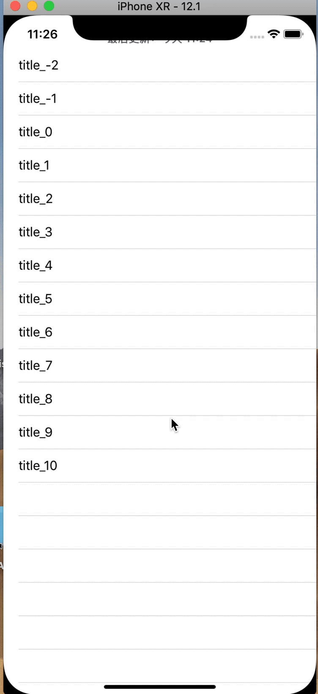
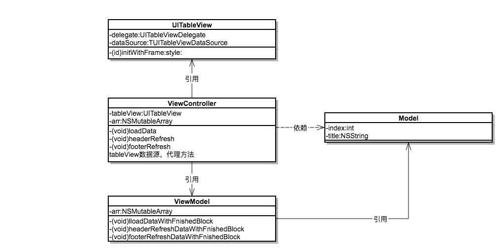
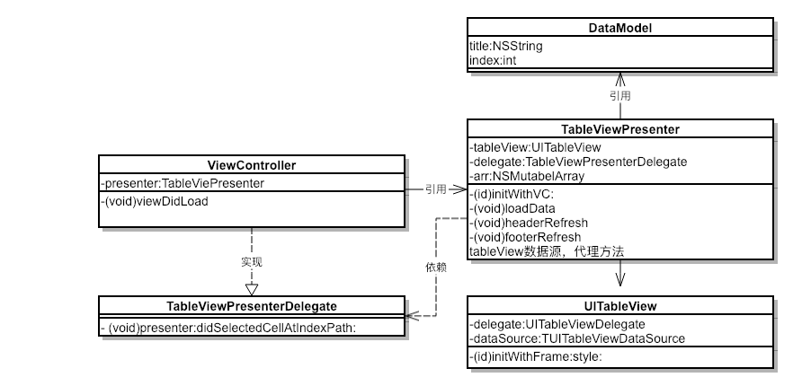
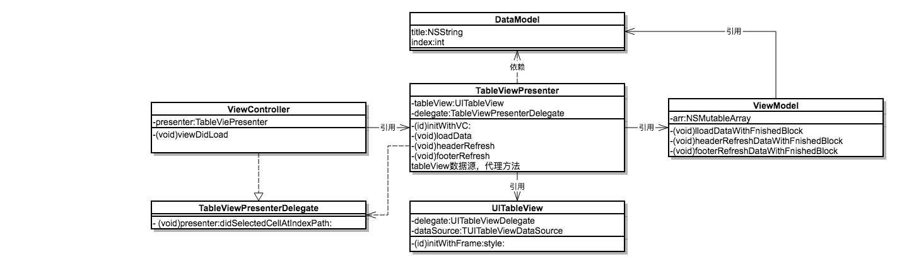

# iOS 架构设计

## 1.概述
iOS 开发中，MVC（Model View Controller）是构建iOS App的标准模式，是苹果推荐的一个用来组织代码的权威范式，iOS自己的库基本都是这个模式，而它的缺点如下：

* ViewController代码厚重
* 功能模块划分混乱
* 可测试性差

随着工程越来越大也表现得更加明显，继而MVVM，MVP等架构设计流行起来,这个demo分别用我所理解的MVC,MVVM,MVP实现，方便对比，关于两者的理论却别可以看这篇 [文章](https://www.jianshu.com/p/4d263d6a68e0) ,demo大体如下:

## 2.MVVM方式实现类图

#### ViewController持有一个ViewModel，这个ViewModel返回ViewController中tableView需要的数据，UI控件的事件操作让ViewModel去处理，ViewController解放数据处理的能力

### 思路：

- Controller 引用viewModel，返回view的可用数据 ，但反过来不行（即不要在viewModel中引入#import UIKit.h，任何视图本身的引用都不应该放在viewModel中）
- viewModel 引用model，但反过来不行
- Controller 尽量不涉及业务逻辑，让 viewModel 去做这些事情

### 优势：

- View可以独立于Model变化和修改，一个 viewModel 可以绑定到不同的 View 上
- 开发人员可以专注于业务逻辑和数据的开发(viewModel)，设计人员可以专注于页面设计
- 通常界面是比较难于测试的，而 MVVM 模式可以针对 viewModel来进行测试

### 弊端：

- 数据绑定使得Bug 很难被调试，有可能是View的代码问题，也可能是 Model的代码有问题
- 对于过大的项目，数据绑定需要花费更多的内存。

## 3.MVP方式实现类图

#### 将ViewController中tableView的数据处理以及UI交互等处理交给Presenter,ViewController只关注自己生命周期，通知监听及对其他模块的调用
### 思路：
- 将Controller中某一UI模块单独抽取一个presenter类，将这个模块的UI控件操作及数据处理封装其中，以delegate方式通知Controller它需要关心的事件
- Controller其实将view和viewController传递给了P层, 这样P层其实就拥有了控制器的权利, 完全可以行使控制器对这个UI控件的职责.
- Controller又持有Presenter, 那么它只需要调用P层暴露出的接口, 就完全可以完成整个业务逻辑和页面展示
- Controller只负责控制页面跳转，调用其它模块。
- 任务均摊，我们将最主要的任务划分到 Presenter 和 Model，而 View 的功能较少

### 优势：

- 模块化UI组件，Controller结构更加清晰，责任更单一，只需关注各个大模块的调用
- UI组件复用好

### 弊端：

- presenter之间的交互比较困难，模块抽取粒度衡量难度大

## 4.MVP和MVVM的结合使用

#### 将在MVP的基础上，把presenter类中对数据的处理单独抽取一个viewmodel，这样业务逻辑也更加独立，类图也更清晰
### 思路：
- 先用mvp的思路抽取presenter，分离Controller对UI控件的处理
- 在presenter中，把业务数据处理抽取一个viewmodel，然后presenter引用这个viewmodel.

### 优势：

- 模块化UI组件，同时分离了业务处理逻辑，Controller，结构更加清晰，presenter代码更易维护
- UI组件复用好

## 5.总结

- MVVM通过抽取业务数据逻辑而减少Controller的代码
- MVP通过模块化各个UI组件来减少Controller的代码

MVVM，MVP各个有各自的优缺点，主要职责是减少Controller里面的代码量，理解了这层关系，在做业务的时候仔细分析业务模块划分，细化责任级别，就可以设计出清晰易懂的架构

	

